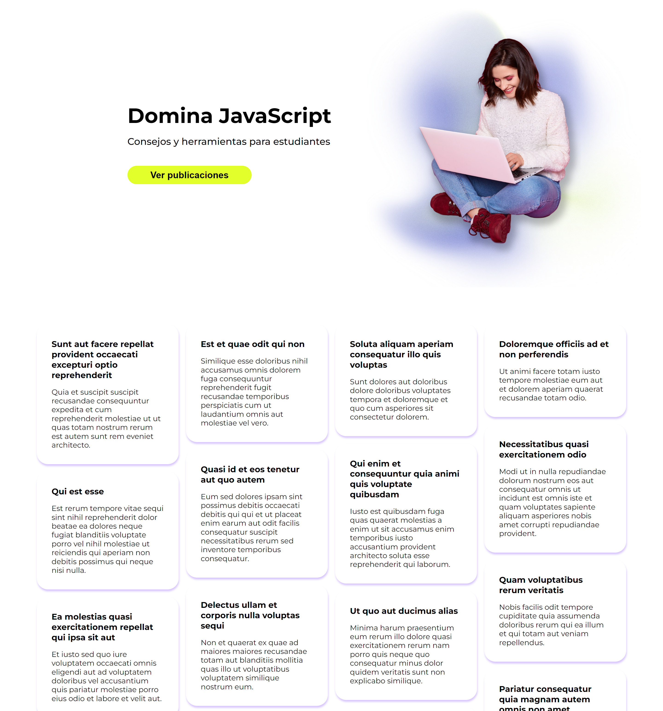
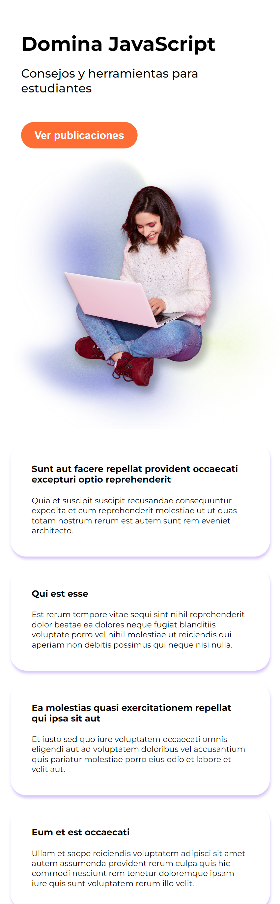

# Desafío - Traer posts 

En  este  desafío  se validan los conocimientos de APIs  y  manejo  de errores.

## Screenshots

## Requerimientos

1. Realizar un request (consulta) a la API usando async-await. (https://jsonplaceholder.typicode.com/posts)
 
2. Mostrar el resultado del request en HTML (utilizar listas desordenadas para mostrar cada uno de los post). 

3. Manejar los posibles errores con try-catch.  